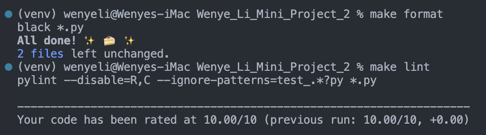

This repo contains work for mini-project 2. It sets up an environment on codespaces and uses Github Actions to run a Makefile for the following: `make install`, `make format`, `make lint`, and `make test`.

Requirements are as follow:

- Python script using Pandas for descriptive statistics
- Read a dataset (CSV or Excel)
- Generate summary statistics (mean, median, standard deviation)
- Create at least one data visualization
- In addition, I include a generateed pdf of the datasets I chose using ydata-profiling.

## Format, lint, and test codes

1. Format code by using `make format` command
2. Lint code by using `make lint` command
   
3. Test code by using `make test` command
   

## Visualizations

Visualizations can be ran by using `python test_main.py`.

## Summary statistics of dataset

Summary reports can be generated using `python test_main.py`.

